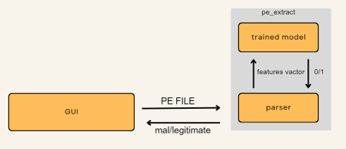

# Attack Detection Project - detection of malicious PE files

### Created by:
- Yehonatan Baruchson
- itamar 

### Abstract:
In the past few years, malware has become one of the most significant threats to computer security. In this project we implemented a new detection model to classify PE files based on the article: “Investigation of Malicious Portable Executable File Detection on the Network using Supervised Learning Techniques”. Our implementation includes new data features for model training and uses a newer dataset. The returned results showed that the proposed system can achieve 99.55% detection rates, 0.0494 false positive rate, and by that we improve the detection part significantly.


### System Workflow and Model Architecture:
Our system flow starts by uploading a PE file to the UI, then the file moves to the extraction process to fetch all features, and so moves all features into the trained model. eventually the classification results presented to the user in the interface.
The classification model architecture is based on a Random Forest classification with 10 trees.
We used the DSC-CLASS dataset from kaggle, to train the model and then to test it. The dataset was splitted into two parts: 70% - training and 30% - testing.


### dataset 
https://www.kaggle.com/datasets/dscclass/malware

## Clasification model results:

Accuracy (RandomForest): 0.99375530798821 Precision (RandomForest): 0.9954730163256577 Recall (RandomForest): 0.9956149732620321 F1 score (RandomForest): 0.9955439897333523

## Architecture



## User Interface Design


### Running the code:
clone this repo, you can do this using
```bash
  git clone https://github.com/Kiinitix/Malware-Detection-using-Machine-learning.git
```

then, open the terminal in that location and install all the dependencies of the project using,

```bash
  pip install -r requirement.text
```

finally - run the main.py file to start the project:

```bash
  python3 main.py
```
## Run exmple video

https://github.com/yehonatanBar61/final_task_PE/assets/93926764/b4915b1b-3e50-4abd-843f-eb67fd1260a8


